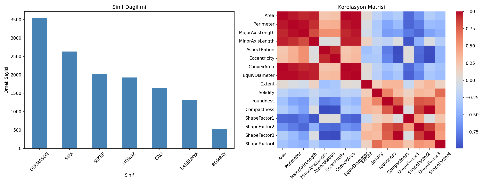
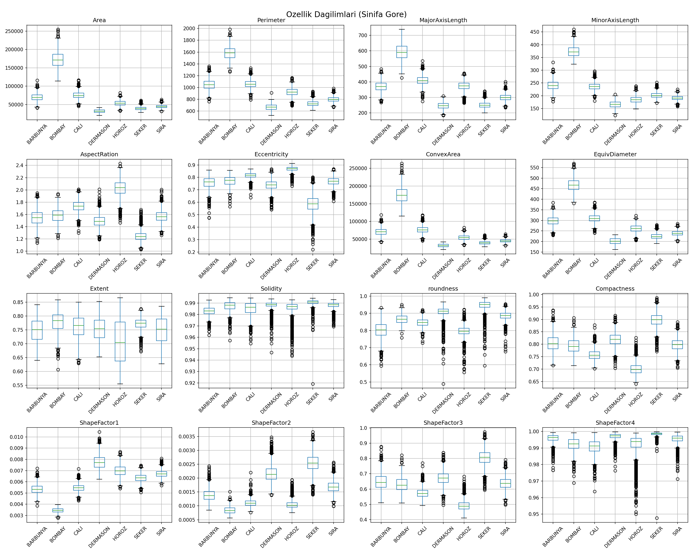
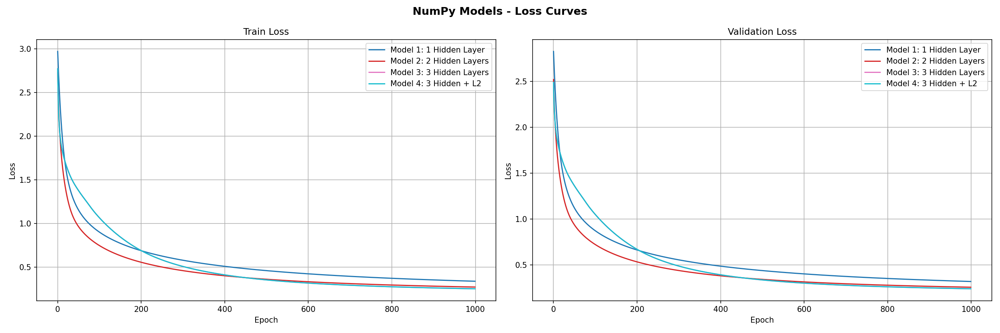
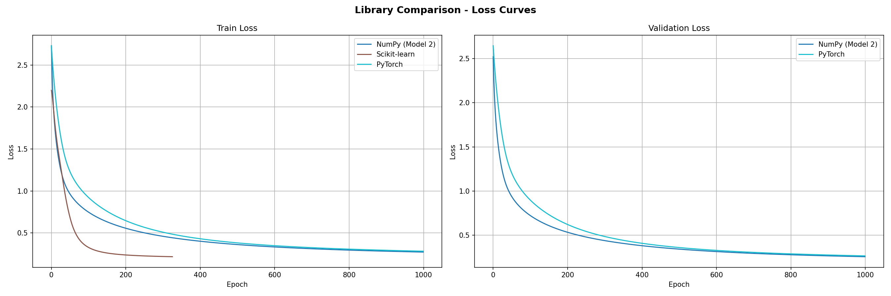
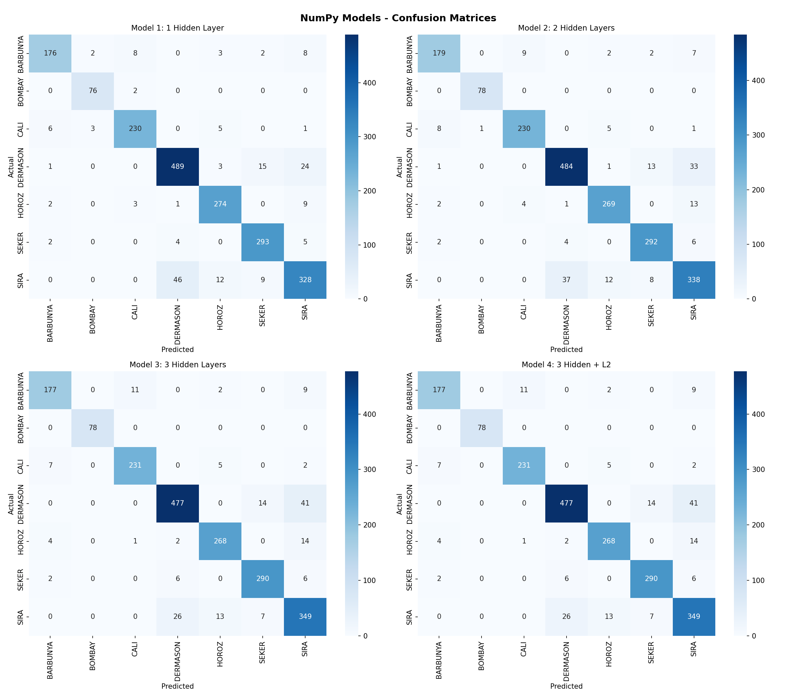
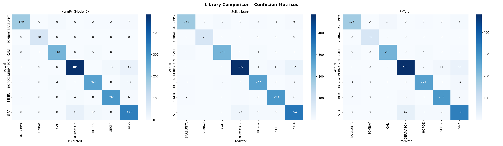
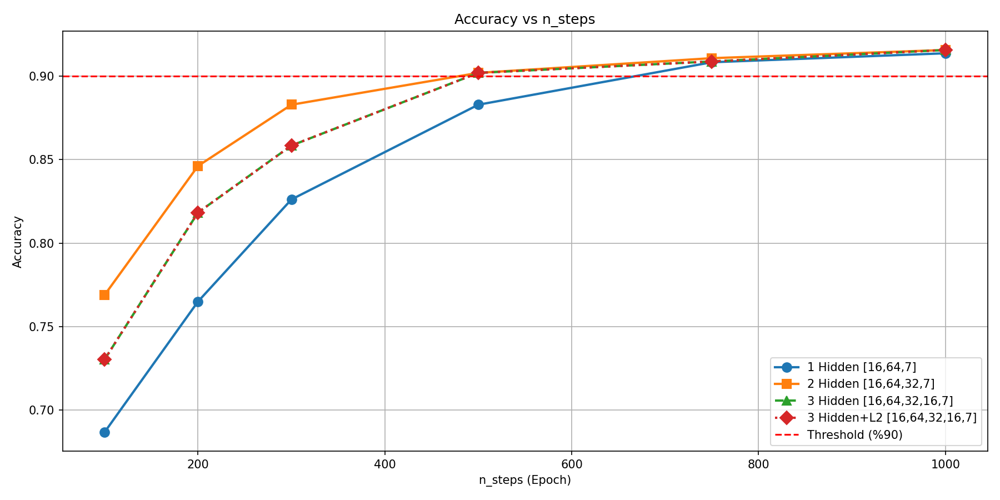

# Dry Bean Classification - Coklu Siniflandirma ile MLP

## Introduction

Bu proje, Ankara Universitesi YZM304 Derin Ogrenme dersi kapsaminda gelistirilmistir. Calismanin amaci, cok katmanli yapay sinir agi (MLP) modellerini sifirdan (NumPy ile) ve kutuphane tabanli (Scikit-learn, PyTorch) olarak uygulayarak, coklu siniflandirma probleminde model egitimi, testi ve optimizasyon calismalarini gerceklestirmektir.

Veri seti olarak UCI Machine Learning Repository'den alinan **Dry Bean Dataset** kullanilmistir. Bu veri seti, 7 farkli kuru fasulye turune ait 13.611 ornegin 16 morfolojik ozelligini icermektedir. Problem, bu ozelliklere dayanarak fasulye turunu tahmin etmeye yonelik coklu siniflandirma problemidir.

**Kaynak:** Koklu, M. and Ozkan, I.A., 2020. Multiclass classification of dry beans using computer vision and machine learning techniques. Computers and Electronics in Agriculture, 174, 105507.

## Methods

### Veri Analizi (EDA)

Veri seti uzerinde kesfedici veri analizi (EDA) yapilmistir:
- Veri setinde **null deger bulunmamaktadir**
- 16 ozelligin tamamimumeric (sayisal) tiptedir
- Sinif dagilimi dengesizdir: DERMASON (3546) en kalabalik, BOMBAY (522) en az ornege sahip siniftir
- Korelasyon analizi sonucunda, ozellikler arasi guclu iliskiler tespit edilmistir (orn: Area-Perimeter, Area-ConvexArea)
- Ozellik dagilimlari siniflar arasi farklilik gostermektedir; ozellikle ShapeFactor1, Eccentricity ve MinorAxisLength ayirt edici ozelliklerdir





### Veri Seti

- **Ad:** Dry Bean Dataset (UCI ML Repository)
- **Ornek sayisi:** 13.611
- **Ozellik sayisi:** 16 (sayisal, morfolojik ozellikler)
- **Sinif sayisi:** 7 (BARBUNYA, BOMBAY, CALI, DERMASON, HOROZ, SEKER, SIRA)
- **Sinif dagilimi:** DERMASON (3546), SIRA (2636), SEKER (2027), HOROZ (1928), CALI (1630), BARBUNYA (1322), BOMBAY (522)

### Veri On Isleme

- Veriler rastgele karistirilmistir (random_state=42)
- Veri bolme orani: %70 egitim / %15 dogrulama / %15 test (stratified split)
- Standardizasyon: Egitim setinin ortalama ve standart sapma degerleri kullanilarak tum setlere uygulanmistir (zero mean, unit variance)
- Hedef degisken one-hot encoding ile kodlanmistir (7 sinif)

### Model Mimarileri

| Model | Mimari | Aktivasyon | L2 Lambda |
|-------|--------|------------|-----------|
| Model 1 | Input(16) -> Hidden(64) -> Output(7) | ReLU + Softmax | 0.0 |
| Model 2 | Input(16) -> Hidden(64) -> Hidden(32) -> Output(7) | ReLU + Softmax | 0.0 |
| Model 3 | Input(16) -> Hidden(64) -> Hidden(32) -> Hidden(16) -> Output(7) | ReLU + Softmax | 0.0 |
| Model 4 | Input(16) -> Hidden(64) -> Hidden(32) -> Hidden(16) -> Output(7) | ReLU + Softmax | 0.01 |

### Hiperparametreler

Calismanin tekrarlanabilmesi icin tum baslangic ayarlari asagida verilmistir:

| Parametre | Deger |
|-----------|-------|
| Learning Rate | 0.01 |
| Optimizer | SGD (Stochastic Gradient Descent) |
| Epoch Sayisi | 1000 |
| Random Seed | 42 |
| Agirlik Baslatma | He Initialization (sqrt(2/n_input)) |
| Bias Baslatma | Sifir |
| Loss Function | Categorical Cross Entropy |
| Cikis Aktivasyonu | Softmax |
| Gizli Katman Aktivasyonu | ReLU |
| L2 Regularization (Model 4) | lambda = 0.01 |
| Batch Size | Full Batch |

### Kutuphane Karsilastirmasi

Ayni mimari (2 gizli katman: 64, 32 noron), ayni hiperparametreler ve ayni egitim/test seti kullanilarak:
- **Scikit-learn:** MLPClassifier (solver='sgd', full batch)
- **PyTorch:** nn.Sequential ile ozel model (SGD optimizer, CrossEntropyLoss)

### Proje Dosya Yapisi

```
Project-1/
├── data/
│   └── Dry_Bean_Dataset.xlsx
├── models/
│   ├── __init__.py
│   ├── numpy_mlp.py        # Sifirdan yazilan MLP (Class yapisi)
│   ├── sklearn_mlp.py      # Scikit-learn MLPClassifier wrapper
│   └── pytorch_mlp.py      # PyTorch MLP modeli
├── utils/
│   ├── __init__.py
│   ├── data_loader.py      # Veri yukleme, on isleme, split
│   └── metrics.py          # Metrikler, confusion matrix, grafikler
├── plots/                   # Tum grafikler (main.py tarafindan olusturulur)
├── main.py                  # Ana calistirma dosyasi
└── README.md
```

## Results

### Model Karsilastirma Tablosu

| Model | Accuracy | Precision | Recall | F1 Score |
|-------|----------|-----------|--------|----------|
| Model 1: 1 Gizli Katman (NumPy) | 0.9138 | 0.9135 | 0.9138 | 0.9133 |
| Model 2: 2 Gizli Katman (NumPy) | 0.9158 | 0.9159 | 0.9158 | 0.9157 |
| Model 3: 3 Gizli Katman (NumPy) | 0.9158 | 0.9171 | 0.9158 | 0.9161 |
| Model 4: 3 Gizli Katman + L2 (NumPy) | 0.9158 | 0.9171 | 0.9158 | 0.9161 |
| Scikit-learn MLP | 0.9275 | 0.9279 | 0.9275 | 0.9276 |
| PyTorch MLP | 0.9114 | 0.9116 | 0.9114 | 0.9114 |

### Sinif Bazinda Performans (Model 2 - NumPy)

| Sinif | Precision | Recall | F1 Score | Destek |
|-------|-----------|--------|----------|--------|
| BARBUNYA | 0.93 | 0.90 | 0.92 | 199 |
| BOMBAY | 0.99 | 1.00 | 0.99 | 78 |
| CALI | 0.95 | 0.94 | 0.94 | 245 |
| DERMASON | 0.92 | 0.91 | 0.91 | 532 |
| HOROZ | 0.93 | 0.93 | 0.93 | 289 |
| SEKER | 0.93 | 0.96 | 0.94 | 304 |
| SIRA | 0.85 | 0.86 | 0.85 | 395 |

### Accuracy vs n_steps Analizi (Model Secimi)

Farkli epoch (n_steps) degerlerinde modellerin dogruluk performansi incelenmistir:

| Model | n=100 | n=200 | n=300 | n=500 | n=750 | n=1000 |
|-------|-------|-------|-------|-------|-------|--------|
| 1 Hidden [16,64,7] | 0.6866 | 0.7649 | 0.8262 | 0.8830 | 0.9084 | 0.9138 |
| 2 Hidden [16,64,32,7] | 0.7689 | 0.8462 | 0.8830 | 0.9021 | 0.9109 | 0.9158 |
| 3 Hidden [16,64,32,16,7] | 0.7302 | 0.8183 | 0.8585 | 0.9021 | 0.9089 | 0.9158 |
| 3 Hidden+L2 [16,64,32,16,7] | 0.7302 | 0.8183 | 0.8585 | 0.9021 | 0.9089 | 0.9158 |

**Model Secim Kriteri:** %90 accuracy'i gecen modellerde en dusuk n_steps secilmistir.

**Secilen Model:** 2 Hidden Layer [16,64,32,7], n_steps=500, Accuracy=%90.21

Bu sonuc, 2 gizli katmanli modelin 500 epoch'ta %90 esigini astigini gostermektedir. 1 gizli katmanli model ayni esige ancak 750 epoch'ta ulasmistir.

### Loss Egrileri

**NumPy Modelleri - Loss Karsilastirmasi (Train / Validation):**


**Kutuphane Karsilastirmasi - Loss Egrileri:**


### Confusion Matrix

**NumPy Modelleri - Confusion Matrix (2x2):**


**Kutuphane Karsilastirmasi - Confusion Matrix:**


### Accuracy vs n_steps



### Overfitting / Underfitting Analizi

- **Model 1 (1 gizli katman):** Egitim ve dogrulama kayiplari birbirine yakin seyretmistir. Model yeterli kapasiteye sahip olup belirgin bir overfitting gozlemlenmemistir.
- **Model 2 (2 gizli katman):** Model 1'e gore hafif bir iyilesme saglanmistir. Katman sayisinin artmasi modelin ogrenme kapasitesini artirmistir.
- **Model 3 (3 gizli katman):** Model 2 ile benzer nihai dogruluk elde edilmistir ancak egitim sureci daha yavas baslamistir. Ek katman bu veri seti icin belirgin bir avantaj saglamamistr.
- **Model 4 (3 gizli katman + L2):** L2 regularizasyon eklenmesi, bu veri seti ve konfigurasyonda belirgin bir fark yaratmamistir. Bu durum, modelin zaten overfitting yapmadigi anlamina gelmektedir.

## Discussion

### Bulgular

1. **Katman sayisinin etkisi:** 1 gizli katmandan 2 gizli katmana gecis, dogrulugu %91.38'den %91.58'e yukseltmistir. 3 gizli katman ise ayni dogrulugu vermis ancak daha yavas yakinsama gostermistir. Bu veri seti icin 2 gizli katman yeterli kapasiteyi saglamaktadir.

2. **L2 Regularizasyonun etkisi:** Model 3 ve Model 4 (ayni mimari, L2 ile/L2 siz) ayni sonuclari vermistir. Bu, modelin bu konfigurasyonda overfitting yapmadigi ve regularizasyona ihtiyac duymadigi anlamina gelmektedir. Daha karmasik modellerde (daha fazla noron) veya daha az veriye sahip problemlerde L2'nin etkisi daha belirgin olabilir.

3. **Kutuphane karsilastirmasi:** Scikit-learn MLP en yuksek dogrulugu (%92.75) elde etmistir. Bu fark, kutuphane ici optimizasyonlardan (momentum, ogrenme orani ayarlama vb.) kaynaklanmaktadir. NumPy ve PyTorch modelleri benzer sonuclar vermistir (~%91).

4. **Sinif bazinda performans:** BOMBAY sinifi en yuksek performansi gostermistir (%99-100). Bu, BOMBAY fasulyesinin diger turlerden morfolojik olarak belirgin sekilde farkli olmasindan kaynaklanmaktadir. SIRA sinifi en dusuk performansi gostermistir (%85), bu da SIRA'nin diger siniflarla daha fazla ozellik ortusumune sahip oldugunu gostermektedir.

### Gelecek Calismalar

- Daha derin mimariler (3+ gizli katman) ve farkli noron sayilari denenebilir
- Dropout regularizasyonu eklenerek overfitting kontrolu yapilabilir
- Mini-batch SGD kullanilarak egitim hizi arttirilabilir
- Ogrenme orani zamanlayicilari (learning rate schedulers) uygulanabilir
- Batch normalization katmanlari eklenerek egitim kararliligi arttirilabilir

## Calistirma

```bash
python main.py
```
