# YZM304 Derin Öğrenme — Proje 2: CNN ile Görüntü Sınıflandırma

**Ankara Üniversitesi — Yapay Zeka ve Veri Mühendisliği Bölümü, 2025–2026 Bahar**

Bu projede **CIFAR-10** veri seti üzerinde evrişimli sinir ağları (CNN) ile özellik çıkarma ve sınıflandırma çalışması gerçekleştirilmiştir. Dört farklı model eğitilip karşılaştırılmıştır:

| # | Model | Açıklama |
|---|-------|----------|
| 1 | **LeNet-5 (temel)** | Elle yazılmış klasik CNN |
| 2 | **LeNet-5 (iyileştirilmiş)** | Model 1 + BatchNorm + Dropout |
| 3 | **AlexNet** | `torchvision.models` üzerinden pretrained fine-tune |
| 4 | **Hibrit (SVM & Random Forest)** | AlexNet özellikleri + klasik ML sınıflandırıcılar |

PDF ödev metninde bahsi geçen 5. model (tam CNN), Model 3 aynı veri setinde uçtan uca tam CNN rolünü üstlendiği için ayrıca uygulanmamıştır (ödev metni bu kısayola açıkça izin vermektedir).

---

## 1. Giriş

Görüntü sınıflandırma, derin öğrenmenin temel problemlerinden biridir ve evrişimli sinir ağları (CNN) bu alanda baskın yaklaşımdır. Bu çalışma, aynı veri seti üzerinde dört farklı CNN-tabanlı yaklaşımı karşılaştırarak şu sorulara yanıt arar:

1. Sıradan bir LeNet-5'e BatchNorm ve Dropout eklenmesi performansı ne kadar iyileştirir?
2. ImageNet üzerinde önceden eğitilmiş bir mimari (AlexNet), küçük bir modelin üzerine ne kadar fark atar?
3. Aynı CNN özellik uzayında uçtan uca softmax ile klasik ML sınıflandırıcıları (SVM, Random Forest) yarıştığında nasıl bir tablo çıkar?

**CIFAR-10**, 10 sınıfa ait 60.000 adet 32×32 RGB görüntüden oluşur (50.000 eğitim, 10.000 test). Sınıflar: *airplane, automobile, bird, cat, deer, dog, frog, horse, ship, truck*. Düşük çözünürlüğe rağmen sınıf içi çeşitlilik (açı, arka plan, renk) yüksek olduğundan LeNet ölçeğindeki küçük modeller için zorlayıcı bir benchmark'tır.

---

## 2. Yöntem

### 2.1. Veri Seti ve Ön İşleme

**CIFAR-10**, `torchvision.datasets` üzerinden otomatik indirilmiştir. Ön işleme her model için farklı tutulmuştur:

| Model | Dönüşüm |
|-------|---------|
| Model 1, 2 (LeNet) | `ToTensor` + `Normalize(mean, std)` — CIFAR-10 kanal istatistikleri kullanılır |
| Model 3, 4 (AlexNet) | `Resize(224)` + `ToTensor` + `Normalize` — ImageNet ortalama/std değerleri |

AlexNet girişi 3×224×224 beklediğinden CIFAR-10 görüntüleri 224'e yeniden boyutlandırılmış ve pretrained ağırlıklar ile uyumlu olması için ImageNet normalizasyon istatistikleri kullanılmıştır.

### 2.2. Modeller

**Model 1 — LeNet-5 Temel.** Elle yazılmış, sadece `Conv2d`, `ReLU`, `MaxPool2d`, `Flatten` ve `Linear` katmanlarından oluşan klasik LeNet-5 mimarisi:

```
Conv(3→6, 5×5) → ReLU → MaxPool(2×2)
Conv(6→16, 5×5) → ReLU → MaxPool(2×2)
Flatten → Linear(400→120) → ReLU
Linear(120→84) → ReLU → Linear(84→10)
```

Toplam **62.006 parametre**.

**Model 2 — LeNet-5 İyileştirilmiş.** Model 1'in filtre sayıları, çekirdek boyutları ve FC birim sayıları **birebir aynı** tutulmuş; her konvolüsyon sonrası `BatchNorm2d`, her FC sonrası `BatchNorm1d` ve `Dropout(p=0.5)` eklenmiştir. Bu sayede ödevin "ikinci modelde hiperparametreler aynı kalacak, iyileştirici özel katmanlar eklenecek" şartı karşılanır. Toplam **62.458 parametre** (sadece BN istatistiklerinden kaynaklanan küçük artış).

**Model 3 — AlexNet (pretrained).** `torchvision.models.alexnet(weights=IMAGENET1K_V1)` ile yüklenmiş; son tam bağlantılı katman 1000 sınıftan 10 sınıfa indirgenip fine-tune edilmiştir. Toplam **57.044.810 parametre**.

**Model 4 — Hibrit (AlexNet özellikleri + klasik ML).** Eğitilmiş Model 3 yüklenip son `Linear(4096→10)` katmanı kaldırılır; kalan ağ bir özellik çıkarıcıya dönüştürülür. Tüm eğitim ve test görüntüleri bu ağdan geçirilerek **4096 boyutlu vektör** embeddingleri `.npy` dosyaları olarak kaydedilir. Bu vektörler üzerinde iki ayrı klasik ML modeli eğitilir:

- **Model 4a — SVM:** `StandardScaler` + `SVC(kernel="rbf", C=1.0, gamma="scale")`
- **Model 4b — Random Forest:** `RandomForestClassifier(n_estimators=200, n_jobs=-1)`

Özellik dosyaları (`model4_hybrid/features/` altında):

```
X_train.npy : shape=(50000, 4096), dtype=float32, length=50000  (781.25 MB)
y_train.npy : shape=(50000,),      dtype=int64,   length=50000
X_test.npy  : shape=(10000, 4096), dtype=float32, length=10000  (156.25 MB)
y_test.npy  : shape=(10000,),      dtype=int64,   length=10000
```

### 2.3. Eğitim Hiperparametreleri

| Model | Optimizer | LR | Batch | Epoch | Loss | Seed |
|-------|-----------|-----|-------|-------|------|------|
| Model 1 | Adam | 1e-3 | 64 | 20 | CrossEntropy | 42 |
| Model 2 | Adam | 1e-3 | 64 | 20 | CrossEntropy | 42 |
| Model 3 | Adam | **1e-4** | 128 | 20 | CrossEntropy | 42 |
| Model 4a | SVC (RBF, C=1.0) | — | — | — | Hinge (dolaylı) | 42 |
| Model 4b | RandomForest (200 ağaç) | — | — | — | Gini | 42 |

**Tercih gerekçeleri.** CrossEntropyLoss çok sınıflı problemde logistik benzer bir log-olasılık hedefi kurar ve gradyan akışı açısından kararlıdır; sınıflar arası rekabeti doğrudan modeller. Adam, düşük ayarlama maliyeti ile iyi varsayılan davranış sergilediği için tüm CNN'lerde tercih edilmiştir. Model 3'te LR, pretrained ağırlıkları bozmamak için 10 kat düşük (1e-4) seçilmiştir. Batch boyutu LeNet için 64, AlexNet için 128'dir; büyük modelde batch'in büyütülmesi GPU verimliliğini artırır. Epoch sayısı tüm CNN'lerde 20'ye sabitlenerek karşılaştırma adaleti sağlanmıştır. Tüm deneylerde `seed=42` ve `cudnn.deterministic=True` ile tekrarlanabilirlik hedeflenmiştir.

### 2.4. Değerlendirme Metrikleri

Her model için test seti üzerinde *accuracy*, *macro-precision*, *macro-recall*, *macro-F1*, sınıf başına classification report ve **karmaşıklık matrisi** hesaplanmıştır. CNN modelleri için epoch bazında eğitim/test *loss* ve *accuracy* eğrileri kaydedilmiştir.

---

## 3. Sonuçlar

### 3.1. Genel Karşılaştırma

| Model | Test Acc | Precision | Recall | F1 (macro) | Eğitim Süresi |
|-------|---------:|----------:|-------:|-----------:|--------------:|
| Model 1 — LeNet Temel            | 0.6286 | 0.6275 | 0.6286 | 0.6271 | 120 sn |
| Model 2 — LeNet İyileştirilmiş   | 0.6601 | 0.6533 | 0.6601 | 0.6508 | 125 sn |
| Model 3 — AlexNet (pretrained)   | 0.9146 | 0.9167 | 0.9146 | 0.9149 | 1126 sn |
| **Model 4a — AlexNet + SVM**     | **0.9223** | **0.9227** | **0.9223** | **0.9224** | 315 sn |
| Model 4b — AlexNet + Random Forest | 0.9199 | 0.9203 | 0.9199 | 0.9200 | **27 sn** |

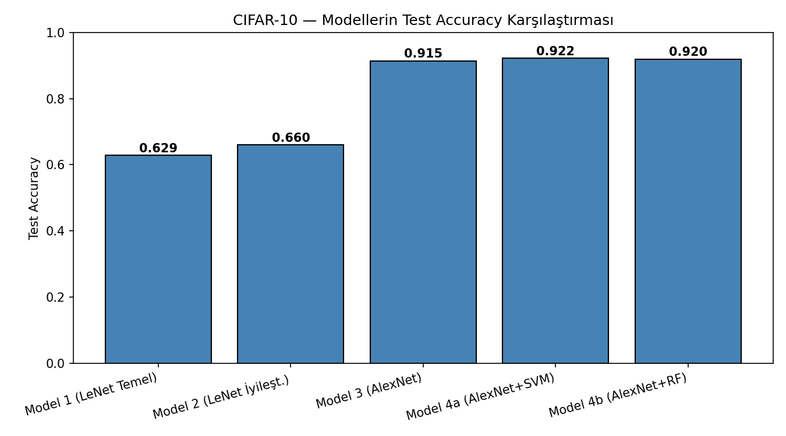

### 3.2. Eğitim Eğrileri

**Model 1 — LeNet Temel**

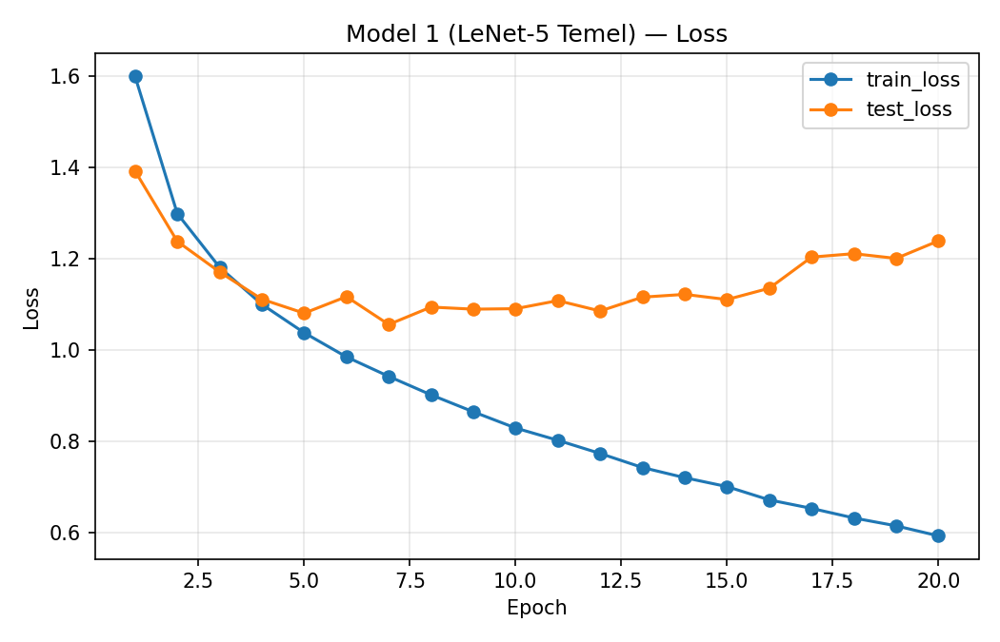
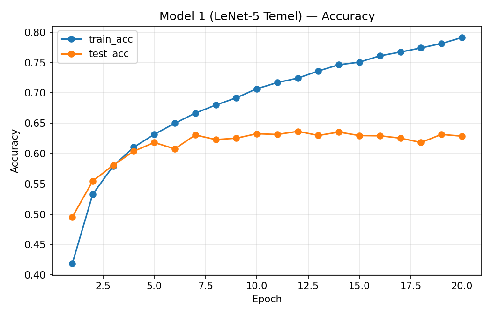

**Model 2 — LeNet İyileştirilmiş (BN + Dropout)**

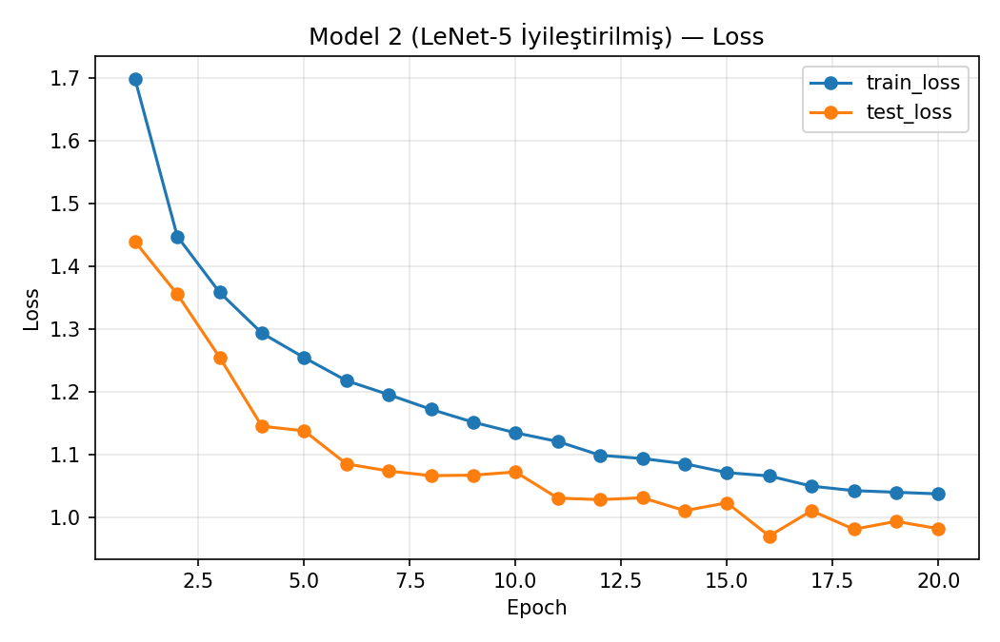
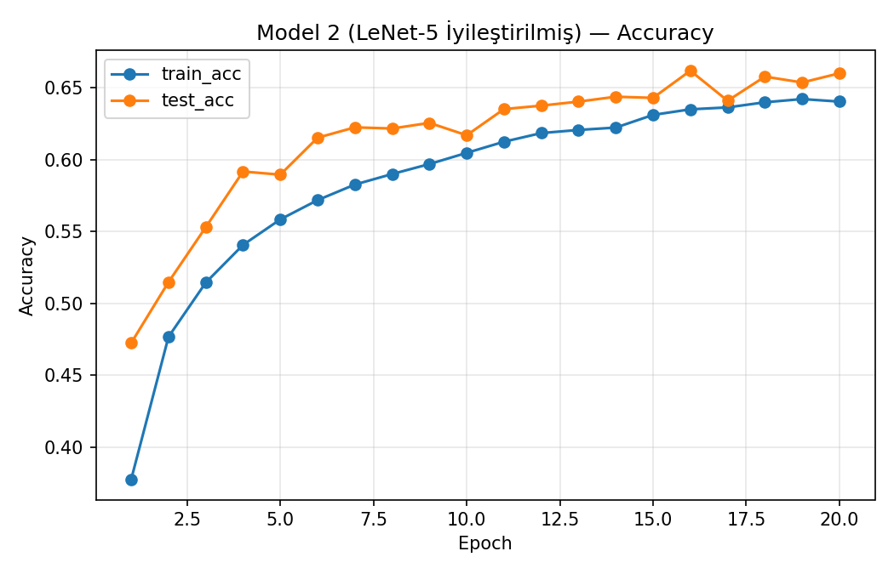

**Model 3 — AlexNet**

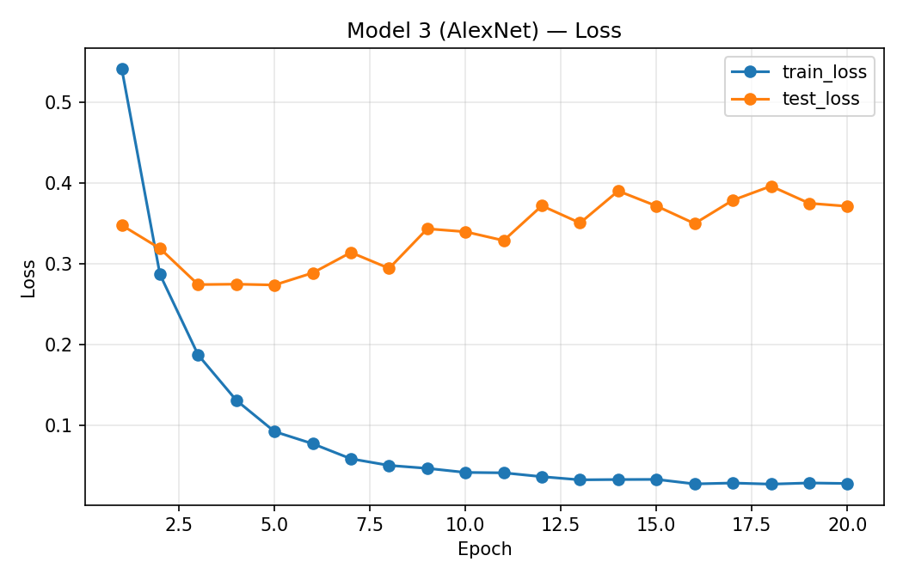
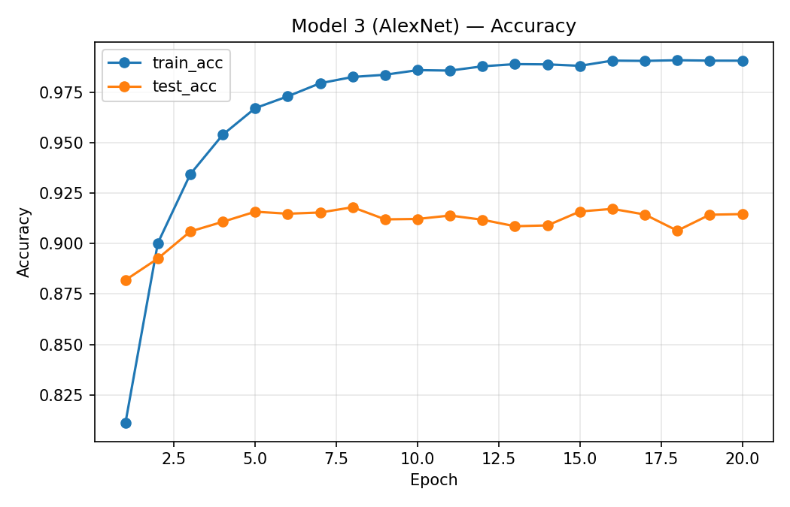

### 3.3. Karmaşıklık Matrisleri

| Model 1 (Temel) | Model 2 (BN+Dropout) |
|---|---|
| 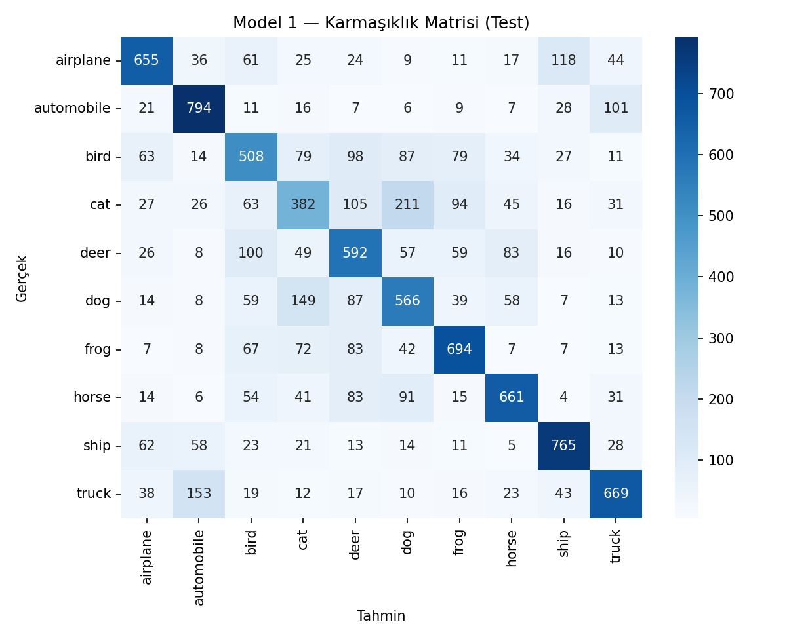 | 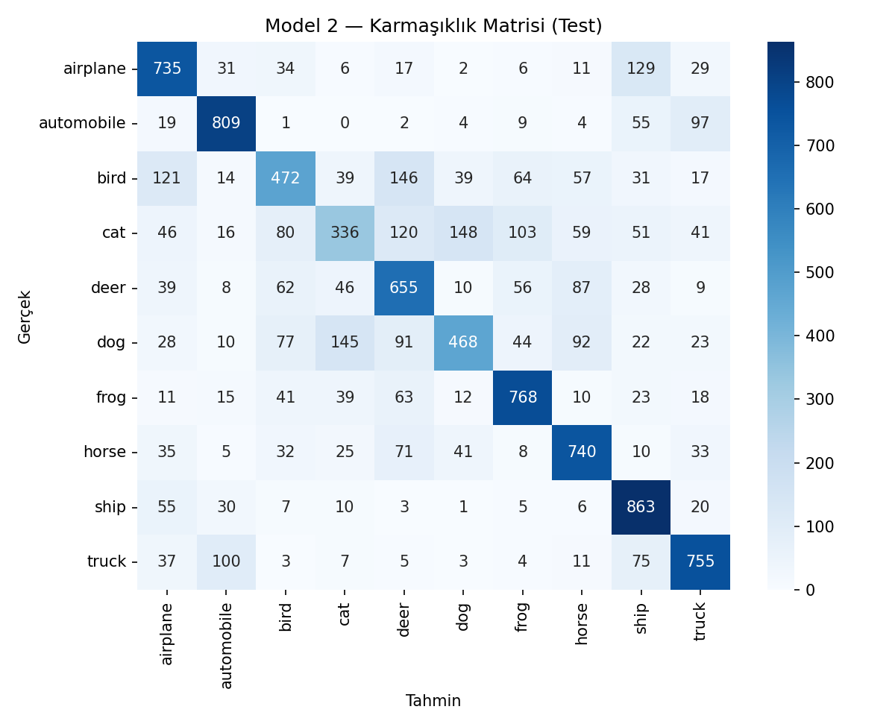 |

| Model 3 (AlexNet) | Model 4a (AlexNet + SVM) | Model 4b (AlexNet + RF) |
|---|---|---|
| 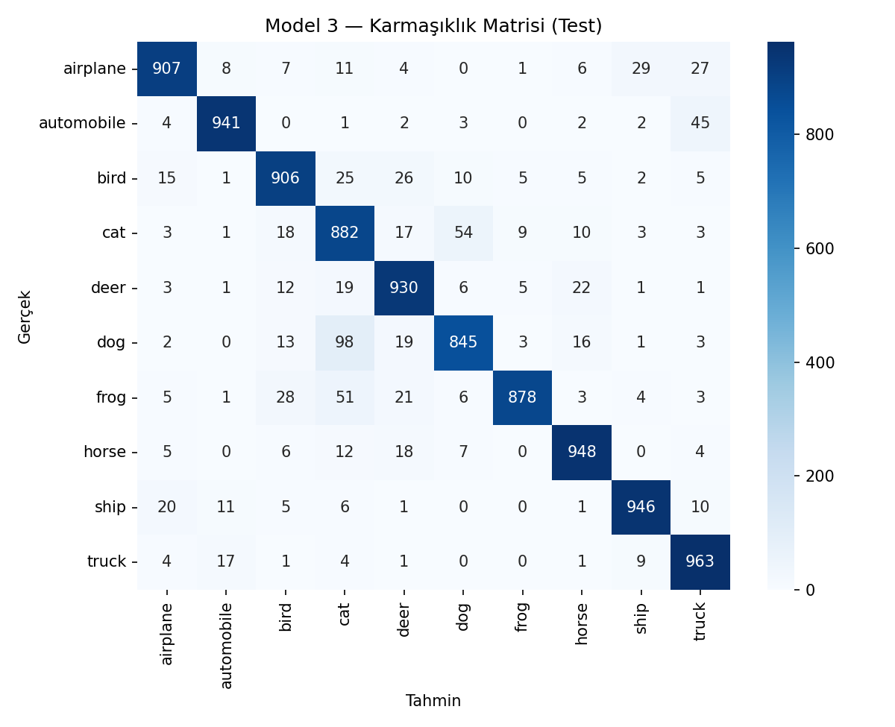 | 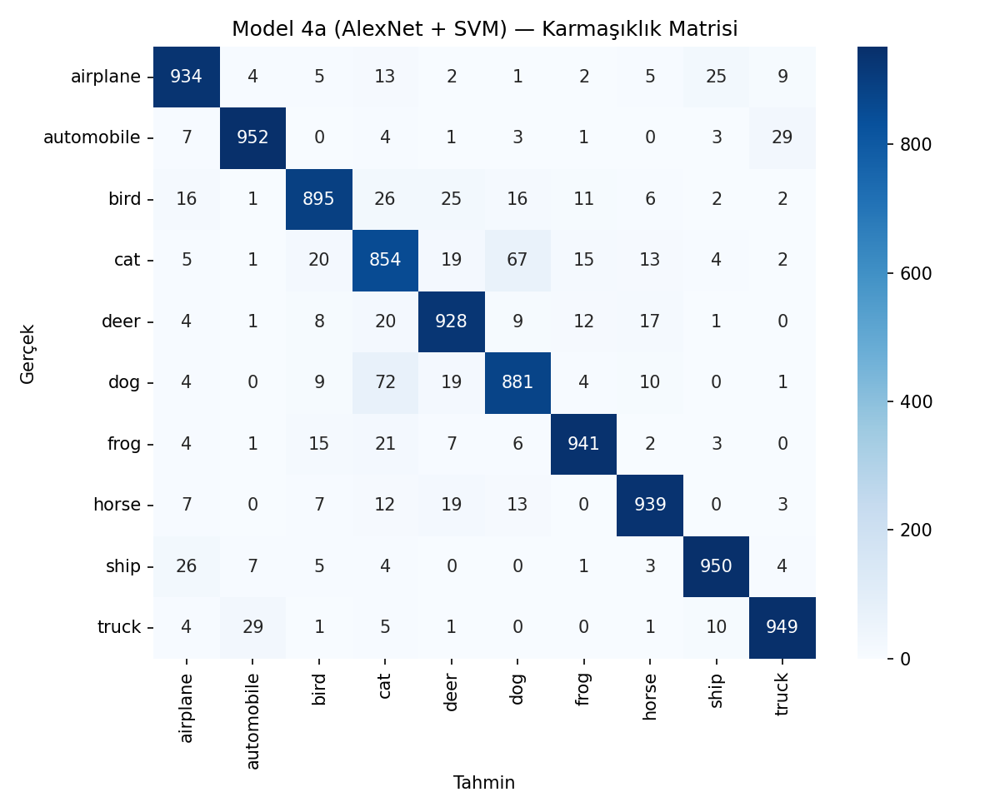 | 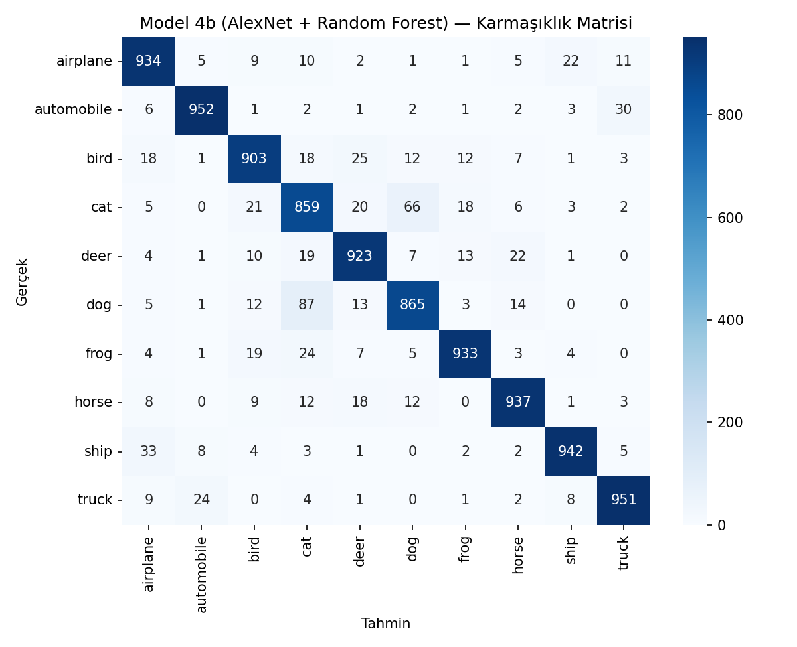 |

### 3.4. Sınıf Bazında Performans (F1)

| Sınıf | Model 1 | Model 2 | Model 3 | Model 4a | Model 4b |
|-------|--------:|--------:|--------:|---------:|---------:|
| airplane   | 0.680 | 0.691 | 0.922 | 0.929 | 0.922 |
| automobile | 0.752 | 0.794 | 0.950 | 0.954 | 0.955 |
| bird       | 0.517 | 0.522 | 0.908 | 0.911 | 0.909 |
| **cat**    | **0.414** | **0.407** | **0.836** | **0.841** | **0.843** |
| deer       | 0.561 | 0.603 | 0.912 | 0.918 | 0.918 |
| dog        | 0.541 | 0.542 | 0.875 | 0.883 | 0.878 |
| frog       | 0.685 | 0.743 | 0.924 | 0.947 | 0.941 |
| horse      | 0.681 | 0.713 | 0.941 | 0.941 | 0.937 |
| ship       | 0.753 | 0.755 | 0.947 | 0.951 | 0.949 |
| truck      | 0.686 | 0.740 | 0.933 | 0.950 | 0.949 |

Koyu satırdaki *cat* sınıfı, tüm modellerde sürekli en zayıf halkadır.

---

## 4. Tartışma

### 4.1. Eğitim Sağlığı ve Overfitting Analizi

Tüm CNN'ler 20 epoch eğitilmiş olsa da her modelin en iyi doygunluk noktası farklıdır.

| Model | En iyi epoch | Test acc (best) | Test acc (son) |
|-------|:------------:|:---------------:|:--------------:|
| Model 1 (LeNet Temel) | 12 | 0.6365 | 0.6286 |
| Model 2 (LeNet + BN + Dropout) | 16 | 0.6619 | 0.6601 |
| Model 3 (AlexNet) | 8 | 0.9180 | 0.9146 |

**Model 1.** Test kaybı epoch ~7'de minimumu (1.056) gördükten sonra sürekli yükselerek 1.239'a çıkar; bu sırada train kaybı 0.94 → 0.59'a iner, train–test accuracy farkı ~16 puana ulaşır. Düzenlileştirme eksikliğinden kaynaklanan klasik overfitting örüntüsü — ve Model 2'nin varoluş gerekçesinin deneysel kanıtı.

**Model 2.** Test kaybı epoch 16'da minimumu (0.970) görür ve 20'ye kadar yakın seviyede kalır. Test doğruluğunun train'den hafif yüksek olması, BN/Dropout'un eğitim sırasında aktif olmasından kaynaklanan normal bir durumdur. Hafif *underfit* eğilimli, daha uzun eğitimde puan kazanabilirdi.

**Model 3.** Pretrained ağırlıklarla ilk epoch'ta %88+ test doğruluğu üretir. Test kaybı epoch 5'te minimumu (0.274) görür, sonra 0.371'e yükselir; train kaybı ise 0.54 → 0.028'e iner. Model doğru tahminlerini daha emin, yanlış tahminlerini daha kesin hale getirir (log-loss kötüleşir) ama doğru sayısı sabit kalır — bu gözlem, Bölüm 4.4'te SVM'in softmax'ı geçmesinin teorik arka planıdır.

**"İdeal epoch" kullanılsaydı kazanç** Model 1 için ~+0.8, Model 2 için ~+0.2, Model 3 için ~+0.3 puan olurdu; sıralamayı değiştirmediği için mevcut sonuçlar korunmuş ve overfitting raporun bulgusu olarak sunulmuştur.

**Öneriler** (kapsam dışı): early stopping, veri artırma (`RandomCrop`, `RandomHorizontalFlip`), AdamW ile weight decay, `CosineAnnealing`/`StepLR` scheduler.

---

### 4.2. BatchNorm + Dropout'un Etkisi (Model 1 → Model 2)

Aynı mimari ve hiperparametrelerle sadece normalizasyon ve düzenlileştirme katmanları eklenerek test doğruluğu **+3.15 puan** (0.6286 → 0.6601) artmıştır. Eğitim eğrilerinde Model 2'nin test loss'u çok daha düzgün iner ve train/test farkı daha dar kalır; bu, Dropout'un overfitting'i bastırdığını ve BN'nin optimizasyonu stabilize ettiğini göstermektedir. Parametre sayısı yalnızca **452** birim artmasına rağmen (62.006 → 62.458) kazanç belirgin olması, bu katmanların parametre verimliliği açısından güçlü bir yatırım olduğunu vurgular.

### 4.3. LeNet vs AlexNet — Kapasitenin Rolü

LeNet-5'in ~62K parametresi CIFAR-10'un sınıf içi çeşitliliğini temsil etmeye yetmemektedir; model *underfitting* yaşar. AlexNet ise 57 milyon parametre ve **ImageNet pretrained** ağırlıklar ile başlayarak ilk epoch'tan itibaren test doğruluğunda %88+ değerine ulaşır ve 20 epoch sonunda %91.46'ya yerleşir. İki model arasındaki **~25 puanlık fark** iki kaynaktan beslenir: (i) ağın derinliği ve parametre kapasitesi sayesinde daha zengin özellik hiyerarşisi, (ii) milyonlarca görüntüden öğrenilmiş ön bilginin CIFAR-10'a aktarılması (transfer learning). Ödevin "derinliğin ve pretrained ağırlıkların gücü" başlığı altındaki beklentisi bu gözlemle örtüşmektedir.

### 4.4. Hibrit (SVM / RF) vs Uçtan Uca AlexNet

En dikkat çekici gözlem: Model 4a (AlexNet + SVM) **%92.23** ile Model 3'ün softmax'ını (%91.46) **+0.77 puan** geçmiştir. Aynı özellik uzayına rağmen SVM'in öne geçmesinin nedeni, RBF çekirdeğinin büyük marjinli karar sınırları kurması ve Bölüm 4.1'de belgelenen softmax overfitting'inin sınıflandırma kalitesine yansımasıdır. Random Forest ise **27 saniyede** %91.99 ile SVM'e neredeyse eşdeğer sonuç üretmiştir. Eğitim süreleri karşılaştırması çarpıcıdır: **AlexNet softmax 1126 sn**, **SVM 315 sn**, **RF 27 sn** — derin özellikler üzerine klasik ML, güçlü bir verimlilik/performans dengesi sunar.

### 4.5. Sınıf Bazında Zayıflık: *cat*

Bütün modellerde *cat* sınıfı en düşük F1 değerine sahiptir (Model 1: 0.414, Model 4a: 0.841). Karmaşıklık matrislerinde *cat* tahminlerinin önemli bir kısmı *dog* ile karışmaktadır. Bu, problemden gelen *semantik yakınlık*tır (benzer silüet, benzer arka plan); daha iyi iyileştirme için genelde yüksek çözünürlüklü görüntüler, daha derin modeller veya veri artırma (random crop, flip) önerilir. *Airplane ↔ bird* ve *automobile ↔ truck* de benzer örüntüler içerir fakat daha az belirgindir.

### 4.6. Genel Değerlendirme

Sonuçlar derin öğrenmenin üç pratik ilkesini doğrular: (1) mimari kapasite problem zorluğuna ölçeklenmek zorundadır (LeNet → AlexNet sıçraması); (2) BN + Dropout düşük maliyetle kayda değer kazanç sağlar; (3) transfer learning küçük veri setlerinde en güçlü kaldıraçtır, ve bu özellik uzayı üzerinde klasik ML sınıflandırıcıları uçtan uca eğitimle yarışabilir hatta onu geçebilir.

---

## Proje Yapısı

```
Project-2/
├── model1_lenet_basic/       # Model 1 — elle yazılmış LeNet-5
├── model2_lenet_improved/    # Model 2 — LeNet-5 + BN + Dropout
├── model3_alexnet/           # Model 3 — torchvision AlexNet fine-tune
├── model4_hybrid/            # Model 4 — AlexNet özellikleri + SVM / RF
├── comparison/               # Karşılaştırma tablosu ve grafiği
├── data/                     # CIFAR-10
├── requirements.txt
└── README.md                 # bu dosya
```

## Kurulum ve Çalıştırma

```bash
pip install -r requirements.txt

# Tüm pipeline'ı tek komutla çalıştır:
bash run_all.sh

# Ya da her modeli ayrı ayrı:
python model1_lenet_basic/train.py
python model2_lenet_improved/train.py
python model3_alexnet/train.py
python model4_hybrid/extract_features.py
python model4_hybrid/train_svm.py
python model4_hybrid/train_rf.py
python comparison/build_comparison.py
```

Her model kendi `outputs/` klasörüne metrikleri, sınıflandırma raporunu, eğitim logunu, loss/accuracy eğrilerini ve karmaşıklık matrisini kaydeder. `comparison/` klasörü ise tüm modellerin özetini birleştirir.

---

**Ortam:** Python 3.13 · PyTorch 2.6 + CUDA 12.4 · torchvision 0.21 · scikit-learn 1.8
